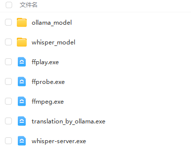

# 视频机翻客户端

> 教程更新中，每个模块都完成了，需要整合起来，便于一般用户使用

## 前言

本项目的目标是实现一套程序，能够让用户在一台家用 PC 上，完成视频的机翻工作。

因为个人不喜欢依赖第三方网络提供的服务，所以，这个机翻的工具其实早就拼凑出来了，只不过不能完全在单机上全部做完，就迟迟没有下文。

随着开源的 LLM 越发强大，本项目的最大的一个瓶颈（任意语言翻译到中文）暂时看来是有满意的解决方案了。

> 既然是机翻，那么需要有一个预期，不可能做到人类级别的翻译，至少近期不可能
>
> 如果单机民用可以部署的 LLM 出来了，更新这个翻译的部分就OK

## 项目最低运行要求

说是家用 PC 就行，也不至于没有最低的要求，这个是考虑到语音识别、翻译的效果、速度。

建议：

* 内存至少 8GB
* 显卡 3060 12GB

至少本人是这个配置，就足够跑起来。如果你的配置达不到，也不是不能用，就是需要花费 10-20 倍以上的时间去完成相同的任务。

## 机翻的速度

这里速度的测试估算是在以下硬件上得到的：

* CPU：i5  10400F
* 内存：32GB
* 显卡：3060 12GB
* 硬盘：固态

视频提取音频和内置字幕，这个一般都挺快的，5min 之内足够

> 注意，如果你的视频不是在本地，比如是在网络或者局域网，那么肯定会更慢

语音转字幕的耗时大概可以这样估算：语音的时长 / 20 = 执行时间

> 一个语音 20 min，那么大概需要 1 min 进行语音的提取。这个是理想情况，实际上可能这个 20 的系数会变为 14 或者更低。

> 注意，如果你的视频不是在本地，比如是在网络或者局域网，那么肯定会更慢

字幕的翻译耗时：10个对白，大概耗时 25 - 30s

## 项目依赖

有以下几个核心的模块是需要单独提及的，这些是需要安装的，或者至少要放到对应的目录来使用的

* FFMPEG
* ollama
* whisperx

## 处理流程

大致的处理流程如下图

## 如何单机部署

如果你家的网络能够流程的访问国际网络，那么，支持的模型的下载都是可以全自动的。

> 最起码还是要能够访问国际网络的哈，完全访问不了就肯定部署不起来的

如果访问国际网络不太稳定，那么就需要把一些大的模型提前下载下来，配置一下也是可以使用的。考虑到这一点，现在的教程优先描述，如何把需要缓存的模型先下载下来，再部署使用。

> 有一些运行的支持库还是要求联网下载的，暂时没想好怎么解决这个部分，这个部分是 whisperx 的支持，大概 300MB 左右，只能假定你能够访问国际网络下载到这些支持吧。

### 01 下载资源

首先你需要去教程最后找到《资源文件下载》，把里面截图中的都下载下来，放到一个目录中。比如：`C:\temp`，请根据实际你的目录来调整，因为这些资源很大，11GB 左右。

### 02 安装 whisper

1. `C:\temp\whisper_model` 中`models--Systran--faster-whisper-large-v3.zip`解压到`C:\temp\whisper_model` 中，应该得到如下目录结构

> `C:\temp\whisper_model\models--Systran--faster-whisper-large-v3` 

2. 理论上可能需要安装 CUDA 11.8 的开发包，但是现在 whisper_server 的打包不确定是否搞定这个支持库，还需要找一台“干净”的机器来做实验才知道

### 03安装 ollama

1. 根据 ollama 官方引导，安装：[Download Ollama on Windows](https://ollama.com/download)
2. 设置系统环境变量`OLLAMA_MODELS`，内容为`C:\temp\ollama_model`
3. `C:\temp\ollama_model` 中`models.zip`解压到`C:\temp\ollama_model` 中，应该得到如下目录结构

> `C:\temp\ollama_model\manifests` 
>
> `C:\temp\ollama_model\blobs` 

4. 在命令行中使用`ollama list`查看本地的模型，应该有以下两个模型

> 如果你网络流畅，可以直接用 `ollama pull allanpk716/translate_srt:latest` 来获取最新的翻译模型

## 如何使用

等待完善文档

## 资源文件下载

链接：https://pan.baidu.com/s/19hbbaxrZhGh5dRTXtDzCiA 
提取码：s53x
