# 视频机翻客户端

> 完成初版啦，Windows 平台使用有问题欢迎反馈。
>
> 源码整理过后会放出来（开放啦）
>
> 理论上这套代码可以在：Windows、Linux、MAC 上都能运行，但是，作者只擅长 Windows，所以···开源后，看大家了···

## 前言

本项目的目标是实现一套程序，能够让用户在一台家用 PC 上，完成视频的机翻工作。

这个机翻的工具其实早就拼凑出来了，因为个人不喜欢依赖第三方提供的在线服务，所以只不过不能完全在单机上全部做完，就迟迟没有下文。

随着开源的 LLM 越发强大，本项目的最大的一个瓶颈（任意语言翻译到中文）暂时看来是有比较满意（英文转中文正确率非常高，其他语言听不懂无法评估）的解决方案了。

> 既然是机翻，那么需要有一个预期，不可能做到人类级别的翻译，至少近期不可能。
>
> 如果是《欢乐一家亲》、《生活大爆炸》类似的剧集，不建议使用机翻，因为很多梗没法解释（或者说至少目前的本地大语言模型做不到解释梗）
>
> 如果单机民用可以部署的 LLM 出来了，更新这个翻译模块就 OK

> 这个项目的生命周期目测不会很长（估计 3 年内就会有成熟的集成方案出来，长期来看，算力和模型能力提升后，播放器自带实时翻译功能并非难事）。

## 项目最低运行要求

说是家用 PC 就行，也不至于没有最低的要求，这个是考虑到语音识别、翻译的效果、速度。

建议：

* 内存至少 16GB
* 显卡 3060 12GB

至少本人是这个配置，就足够跑起来。如果你的配置达不到，也不是不能用，就是需要花费 10-20 倍以上的时间去完成相同的任务。

## 机翻的速度

这里速度的测试估算是在以下硬件上得到的：

* CPU：i5  10400F
* 内存：32GB
* 显卡：3060 12GB
* 硬盘：固态

视频提取音频和内置字幕，这个一般都挺快的，5min 之内足够

> 注意，如果你的视频不是在本地，比如是在网络或者局域网，那么肯定会更慢

语音转字幕的耗时大概可以这样估算：语音的时长 / 20 = 执行时间

> 一个语音 20 min，那么大概需要 1 min 进行语音的提取。这个是理想情况，实际上可能这个 20 的系数会变为 14 或者更低。

> 注意，如果你的视频不是在本地，比如是在网络或者局域网，那么肯定会更慢

字幕的翻译耗时：10个对白，大概耗时 25 - 30s

## 项目依赖

有以下几个核心的模块是需要单独提及的，这些是需要安装的，或者至少要放到对应的目录来使用的

* FFMPEG
* ollama
* whisperx

## 处理流程

大致的处理流程如下图

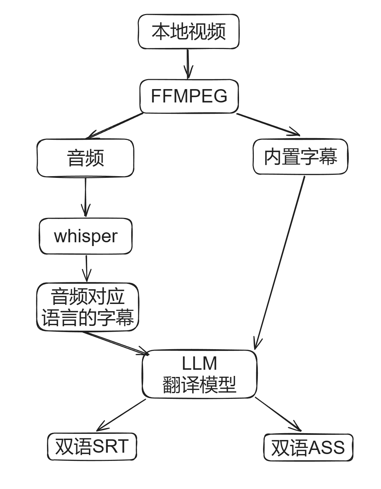

## 如何单机部署

如果你家的网络能够流程的访问国际网络，那么，支持的模型的下载都是可以全自动的。

> 最起码还是要能够访问国际网络的哈，完全访问不了就肯定部署不起来的

如果访问国际网络不太稳定，那么就需要把一些大的模型提前下载下来，配置一下也是可以使用的。考虑到这一点，现在的教程优先描述，如何把需要缓存的模型先下载下来，再部署使用。

> 有一些运行的支持库还是要求联网下载的，暂时没想好怎么解决这个部分，这个部分是 whisperx 的支持，大概 300MB 左右，只能假定你能够访问国际网络下载到这些支持吧。

### 01 下载资源

首先你需要去教程最后找到《资源文件下载》，把里面截图中的都下载下来，放到一个目录中。比如：`C:\temp`，请根据实际你的目录来调整，因为这些资源很大，11GB 左右。

> 截图的这些是最基本的支持库和程序，主程序会在下面提到。

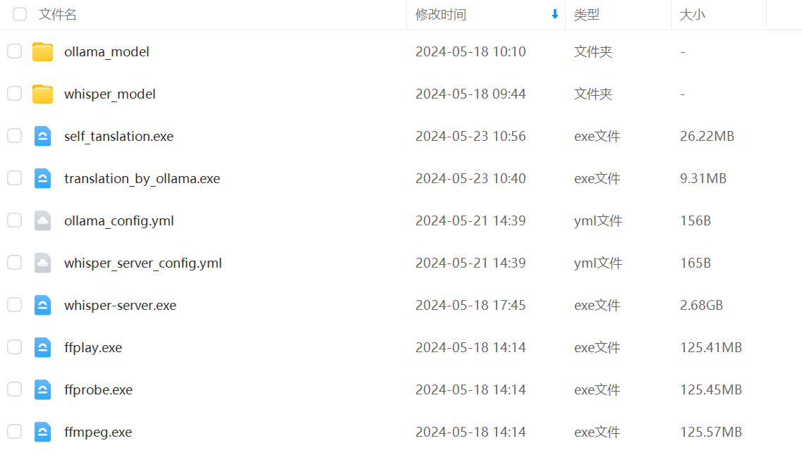

`self_tanslation.exe`，这个是主程序，也需要放在相同的文件夹中，上面截图都是子模块和模型文件。

### 02 安装 whisper

1. `C:\temp\whisper_model` 中`models--Systran--faster-whisper-large-v3.zip`解压到`C:\temp\whisper_model` 中，应该得到如下目录结构

> `C:\temp\whisper_model\models--Systran--faster-whisper-large-v3` 

2. 理论上可能需要安装 CUDA 11.8 的开发包，但是现在 whisper_server 的打包不确定是否搞定这个支持库，还需要找一台“干净”的机器来做实验才知道
2. 双击启动 `whisper-server.exe`，因为是 pyintaller 打包的，所以启动很慢，不报错，启动成功 Windows 防火墙会提示这个程序请求开启 5000 本地端口，你需要同意，否则后续是无法使用的
2. 启动成功就可以关闭了，因为后续是全自动的，本地启动是验证能用

### 03 安装 ollama

1. 根据 ollama 官方引导，安装：[Download Ollama on Windows](https://ollama.com/download)
2. 设置系统环境变量`OLLAMA_MODELS`，内容为`C:\temp\ollama_model`（设置完毕建议注销一次或者重启一次电脑），因为提供了离线的模型下载，所以需要单独设置一下，这里举例是 C 盘，具体看你那个盘空间大，且，最好是固态硬盘
3. `C:\temp\ollama_model` 中`models.zip`解压到`C:\temp\ollama_model` 中，应该得到如下目录结构

> `C:\temp\ollama_model\manifests` 
>
> `C:\temp\ollama_model\blobs` 

4. 在命令行中使用`ollama list`查看本地的模型，应该有以下两个模型

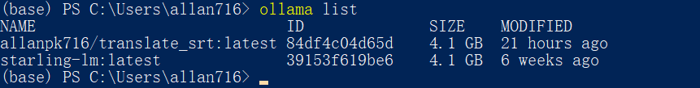

> 如果你网络流畅，可以直接用 `ollama pull allanpk716/translate_srt:latest` 来获取最新的翻译模型，那么就不去下载离线模型了

## 如何使用

你需要完成《单机部署》，把该下载的都下载了，放对目录。

这里直接举例一些使用的命令，请**举一反三**!

### 1 一个视频文件，直接机翻

`.\self_tanslation.exe --video="D:\tmp\test_video\欢乐一家亲\欢乐一家亲 - S05E01 - 第 1 集.mp4"`

那么默认输出的机翻字幕会生成在：`self_tanslation` 同级目录。

### 2 视频文件文件夹，直接机翻

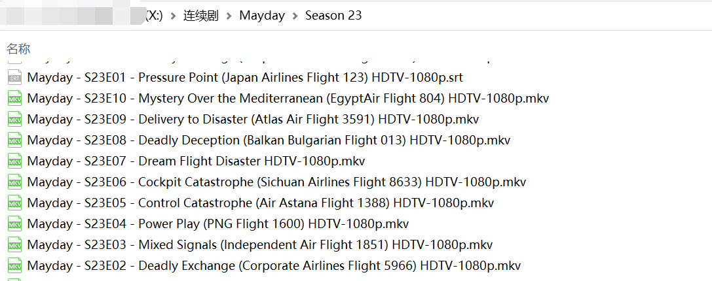

`.\self_tanslation.exe --videos_dir="X:\连续剧\Mayday\Season 23"`

那么默认输出的机翻字幕会生成在：`self_tanslation` 同级目录。

### 3 在一台电脑上导出 ffmpeg 中间文件，然后再到有算力的机器上进行机翻

这个情况是比较特殊的，比如我现在有两个机房：

* A，视频文件存储地
* B，拥有算力，可以进行机翻

但是这两个地方的网络带宽很低，直接使用上面两个示例的去做机翻，会严重的卡在数据传输上面。那么有个傻一点的方案（其实之前做过中间服务器方案，由于法规问题就砍了），在 A 服务器上，现进行 FFMPEG 信息的导出，然后把这些文件复制到 B 服务器上，再进行机翻。

在 A 上面执行：

`.\self_tanslation.exe --videos_dir="X:\连续剧\Mayday\Season 23" --only_do_ffmpeg=true`

然后会在 `self_tanslation` 同级目录下的`ffmpeg_cache`文件夹中，得到对应视频的 FFMPEG 的中间缓存文件

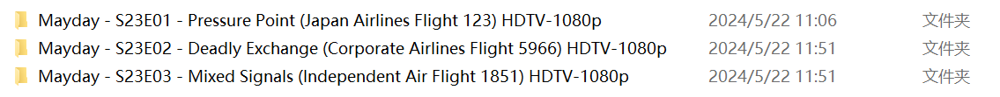

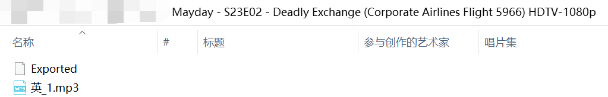

把这些文件夹拷贝到 B 上面，然后执行：

> 比如放到下图文件夹中

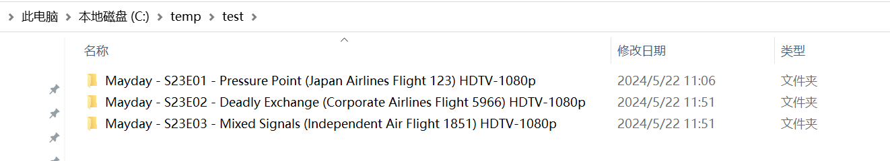

`.\self_tanslation.exe --ffmpeg_files_dir="D:\temp\test"`

那么默认输出的机翻字幕会生成在：`self_tanslation` 同级目录。

## 如何更新

主要是本地部署的模型太大了，基本没法打包成一个来发布，所以最直接的方案就是，看共享盘如果有文件更新就下载替换即可。

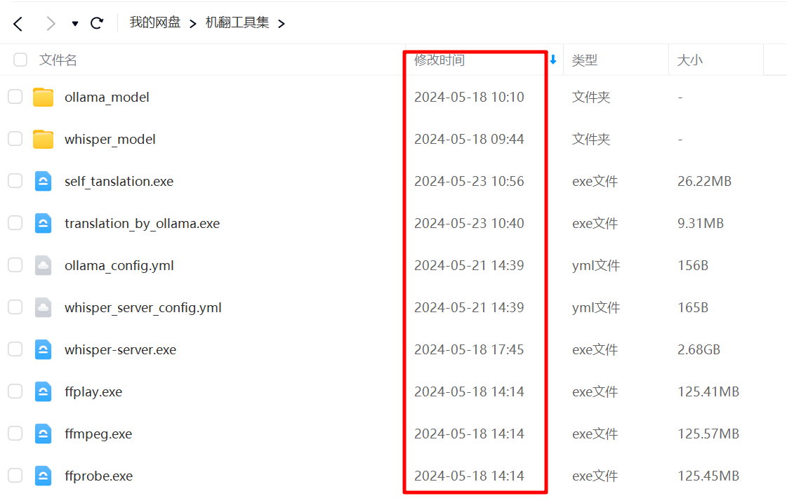

## 资源文件下载

因为涉及到 python 环境的安装和深度学习环境的配置，为了方便，是直接提供打包好的子模块程序。等程序稳定后，再抽时间开源放出来。

链接：https://pan.baidu.com/s/19hbbaxrZhGh5dRTXtDzCiA 
提取码：s53x

## 翻译效果截图

### 执行日志截图

测试输入10 集已经提取好音频的剧集

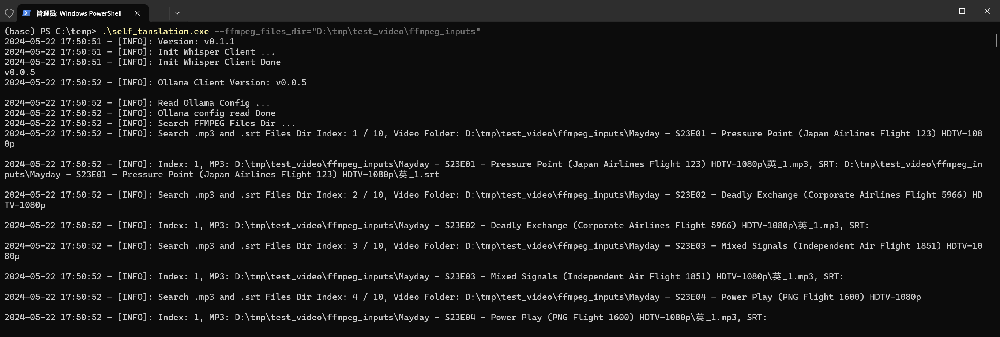

挂机翻译完成，大概 4.5h（每个音频执行了 whisper + 翻译任务），还有优化空间（现在是每次执行都会启动 whisper 和 ollama 加载模型，如果是批量任务，可以先做完所有的 whisper 任务再继续下一个相同类型的批量任务，就无需浪费时间反反复复加载和使用这种大型模型了）

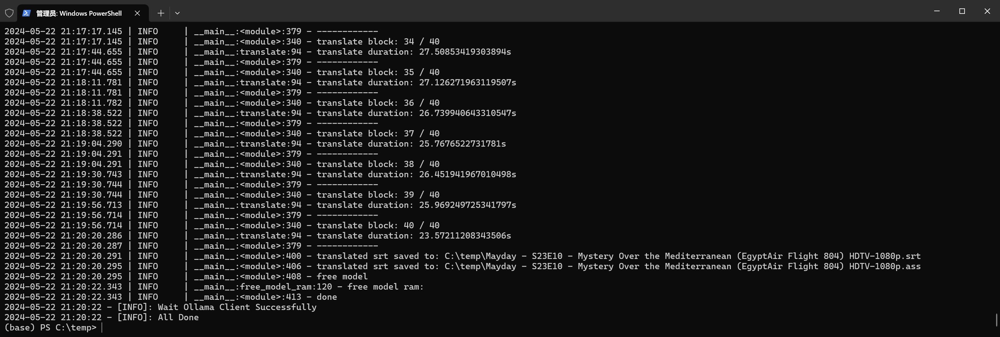

### 翻译效果

SRT

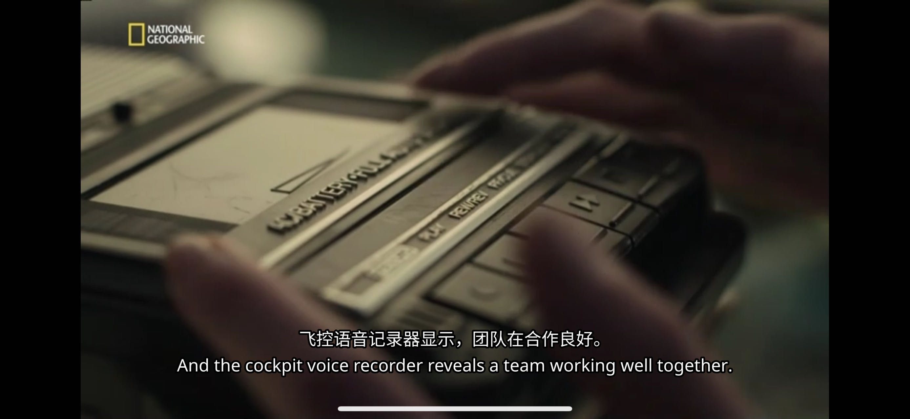

ASS

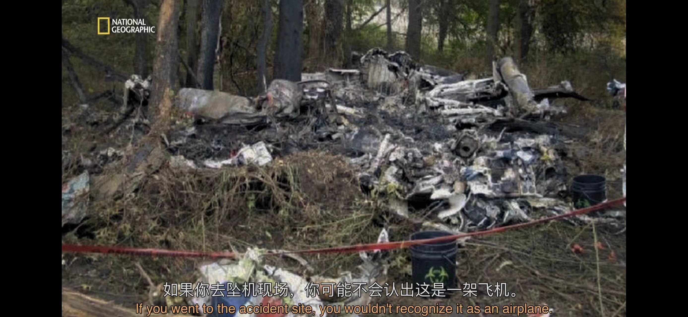

## TODO

1. 制作一个界面程序，方便图形化使用
2. 提供 ASS 字幕 Style 外部配置文件
3. 优化 Whisper-server 的打包体积
4. 提供子模块最新版本查询接口，便于提示更新

## 子模块项目

* [VideoTranslationTools/whisper-server: 使用 openai whisper 进行 V2T (github.com)](https://github.com/VideoTranslationTools/whisper-server)
* [VideoTranslationTools/LLM_translator: 使用本地的 LLM 进行机翻 (github.com)](https://github.com/VideoTranslationTools/LLM_translator)
