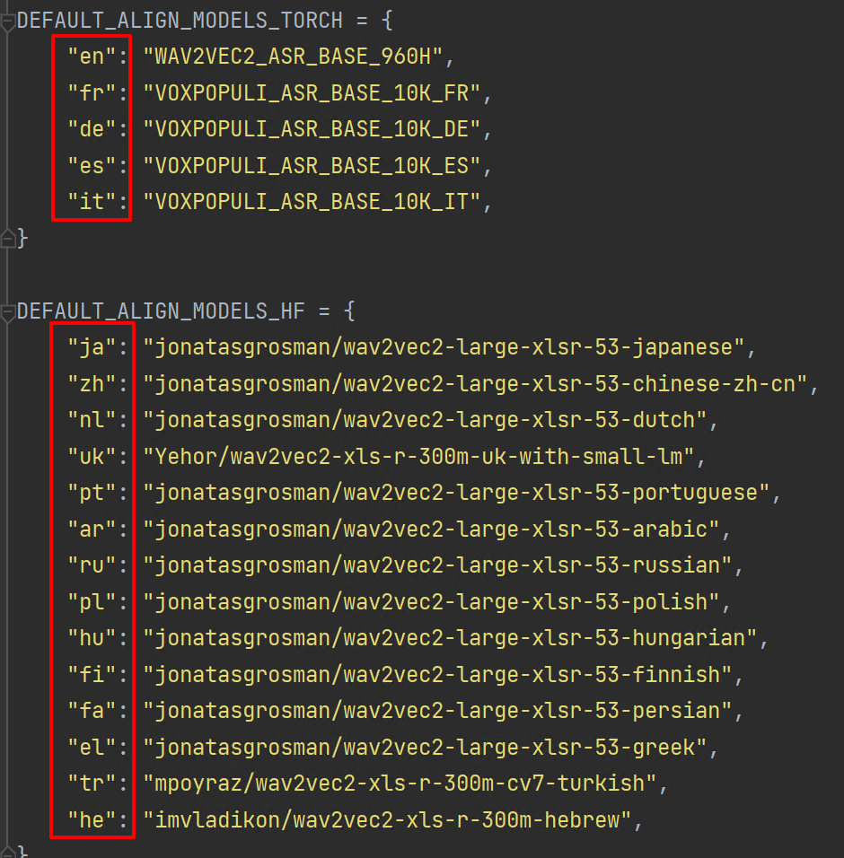

# 视频机翻客户端

> 还在更新使用教程和功能...

## 前言

本项目的初衷是为了更好的看国外没有字幕的视频（可能是 Youtube or 一些纪录片），那么就需要能够做一个机翻的工具来生成字幕。

同时对于使用者，也希望能够尽可能简单的使用。比如，让使用者去安装对应的深度学习的支持库和环境，大概率难。

那么本项目就期望在使用者电脑性能弱鸡（CPU 一般，没有 GPU）的时候，也足够完成这件事情。

使用者需要有一个预期，就是这个项目的翻译质量显然是无法跟专业的字幕人员去对比的。同时生成的字幕断句合理性也有极大的提升空间。

目前是强制生成**中文**的**双语**字幕（也许后期会开放其他语言的翻译支持）。

## 如何使用？

其实机翻任务可以是提交一个视频，也可以是一个字幕。

这个程序的目标是传入:

* 一个 youtube 的 URL ，然后在本地下载然后进行云端的机翻操作，再下载翻译好的字幕文件下来。**输出路径在**：cache 下的对应 youtube 视频名称文件夹下；
* 一个本地的视频，然后本地提取音频，进行云端的机翻操作，再下载翻译好的字幕文件下来。输出的路径在：对应视频文件目录下 xxx_translated.srt
* 一个本地的字幕，进行云端的机翻操作，再下载翻译好的字幕文件下来。**输出的路径在**：对应字幕文件目录下 xxx_translated.srt

可以接受传入的参数：

```shell
machine_translator_client.exe -video "C:\\123.mp4"  # 机翻一个本地的视频
machine_translator_client.exe -subtitle "C:\\123.srt" # 机翻一个本地的字幕
machine_translator_client.exe -url "https://www.youtube.com/watch?v=lhYGXYeMq_E" # 机翻一个在线的 youtube 的视频

machine_translator_client.exe -video "C:\\123.mp4" -lang "en"  # 机翻一个本地的视频，指定这个视频的语言是 en
```

支持指定的语言类型见下图：




举个例子：（这里假定你的系统是 Windows，请举一反三）

现在有一个 Youtube 的视频：https://www.youtube.com/watch?v=lhYGXYeMq_E

想要获取对应的中文字幕。那么可以使用本项目提供的 [VideoTranslationTools/client](https://github.com/VideoTranslationTools/client/releases)

1. 先下载这个程序，放到 `C:\WorkSpace\videio_translation`

2. 需要下载 Youtube 的视频下载程序：[yt-dlp](https://github.com/yt-dlp/yt-dlp/releases)，将这个`yu-dlp.exe`放到`C:\WorkSpace\videio_translation`中

3. 安装 ffmpeg 和 ffprobe，确保你的系统全局能够在控制台访问它们（不行你就丢上面这个目录中也行）；

4. 申请 ApiKey（待添加教程）

5. 在这个目录下新建一个 `etc` 目录

6. 在 `etc` 目录下新建一个 `config.yaml` 文件，这个是该程序的配置文件示例

   ```
   ServerBaseUrl: "xxx"
   ApiKey: "123456"
   ProxyType: "http"
   ProxyUrl: "http://192.168.50.252:20171"
   CacheRootFolder: ".\\cache"
   YTdlpFilePath: "C:\\WorkSpace\\youtube\\yt-dlp.exe"
   ```

> ServerBaseUrl： 机翻服务器的 API 地址
>
> ApiKey：用户的密钥（每天有使用次数限制）
>
> 代理设置：
>
> 如果你所在的地区访问 Youtube 有限制
>
> * ProxyType: 可以填写 `"no"、"http"、"socks5"`，不启用就是 `"no"`
> * ProxyUrl:  `"http://192.168.50.252:20171"` 请举一反三的设置
>
> CacheRootFolder：这个是缓存的目录，也是下载 Youtube 视频的缓存目录，同时也是字幕最终的存放目录。会根据下载的视频标题来新建目录存储。
>
> YTdlpFilePath：这个是 Youtube 下载器的存放位置。

基本的使用的参数为：

```shell
machine_translator_client.exe -url "https://www.youtube.com/watch?v=lhYGXYeMq_E"
```

那么将在以下目录生成对应的下载视频的目录：


下面是翻译效果：


## 字幕校对

现成的工具很多，这里推荐一个：[Happy Scribe: Audio Transcription & Video Subtitles](https://www.happyscribe.com/)

如果你有更好推荐的，可以提 issues。

## 后续的期望

如下图，本程序的划分了 4 个类型的 Worker 工作者（每个类型的工作者可以有若干个），架构思路是分布式任务系统。

目前项目提供了云端基础的计算服务，大家可以先玩。如果后期算力瓶颈了，工作者模块的代码也成熟了，会发布出来。这样有富于算力的童鞋们可以在你的设备上进行部署，分摊计算压力。

云服务器的代码暂时不打算开源，因为跟之前一些项目耦合度较高，还需要重构分离功能。


## 风险控制（正在开发...）

因为本项目属于“用爱发电”，所以避免一些问题，会在字幕翻译**前**进行内容风险控制和评估（关键词、或者整体文字的大意内容），

## 隐私

因为会有云端计算功能，所以一定会上传对应的音频和字幕到云服务器，服务器会在 1 天后自动删除文件，同时任务如果 1 天内没有执行完毕也会被删除。

> 如果后续开放第三方的 Worker 接入进来，还需要重新设计确保拿到的数据在硬盘上是加密的。（同理因为这个原因也可能不打算公开 Worker）
